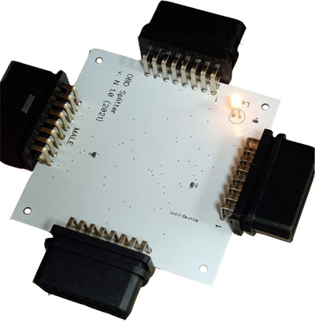

# About

Obd2Splitter device is a simple OBD-II socket splitter. It has one input and 3 outputs. All based on simple and affordable components from AliExpress market.
We represent here:
* Schematic;
* PCB design (Gerber x2);
* 3d printer model for the housing.

Using these files you can create it and use freely.

# PCB and Schematic

You can find gerber (v2) files with drills in the gerber folder.

The PCB contains a few components only.

R1, R2 - 120 Ohm, 0603 (CAN terminator emulator) - you can install them or not. These resistors are usually needed
to test ECU on the desk without any termination ECUs on the bus (CAN-bus uses two terminator resistors 120Ohm - one at the beggining of the bus, and the second at the end of it).

R3 - 1,5 Kohm, 0603 (LED's resistor, depends on apmerage of the LED you use);
D1 - LED indicator;
Three OBD Female sockets and one MALE;

# Parts

The parts can be found on AliExpress market.
Those parts are "strange" China sockets. Why strange? The reason is that female socket created in quite opposite the male one.

Obd male connector with 90 degrees angled pins is designed the way the key is at the top of it. 

But female connector designed the way the key is at the bottom.

The direct links to AliExpress does not live long, so we publish names how to find those parts:

* OBD2 Male Connector Plug Right Angle 90 degree Golden Plating Pin;
* OBD II OBD2 90 Degrees 16 Pin Female Connector Adapter;

You can also check if the pictures of those parts are similar to above ones.

# Final device

The final device is presented on the picutre below. It provides good, reliable connection to all pins of OBD-II connector. You can attach up to three diagnostic devices to the one OBD-II female. We use it together with [Zend Table](https://clearcrash.ru/zend-table-perform-diagnostics-with-no-car-available/) to start ECU without a vehicle.

# Housing

Use STL-format model, stored in **box** folder in order to print a housing. Use srews (2.5x25 mm) to fix it up.

